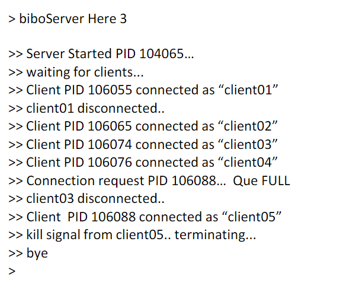
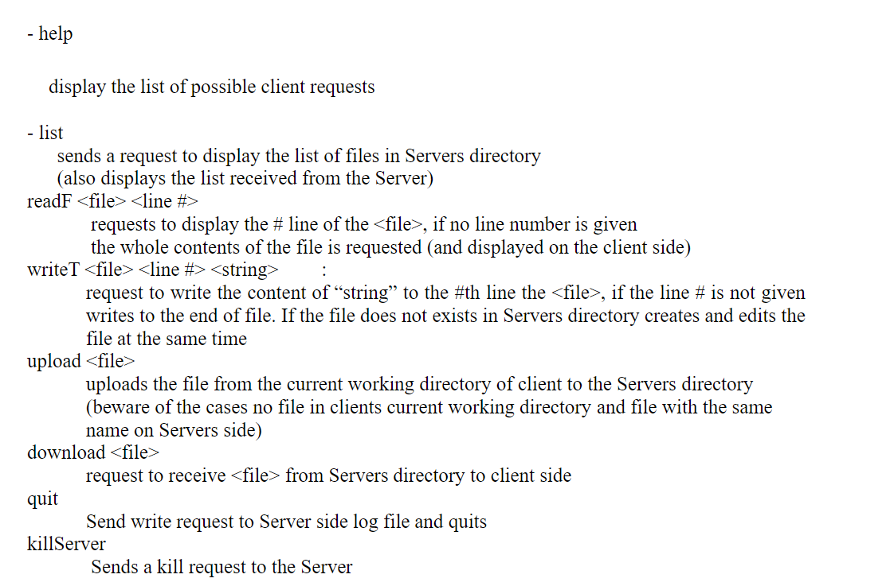
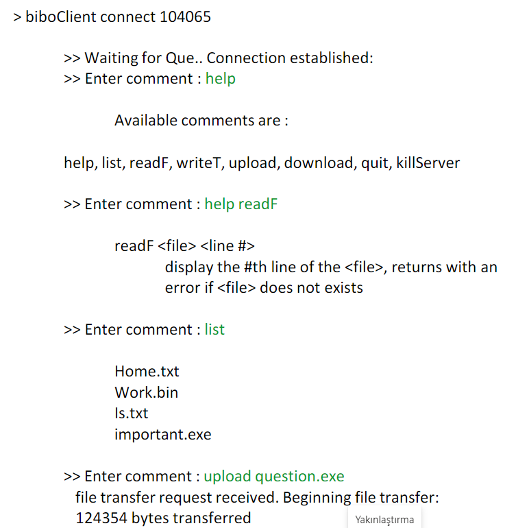
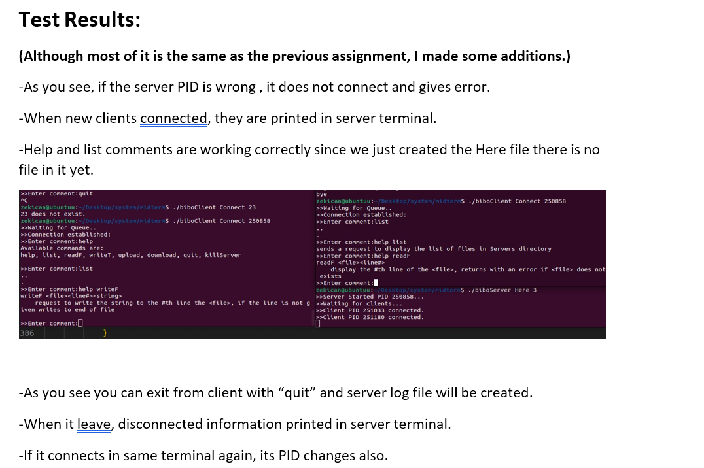
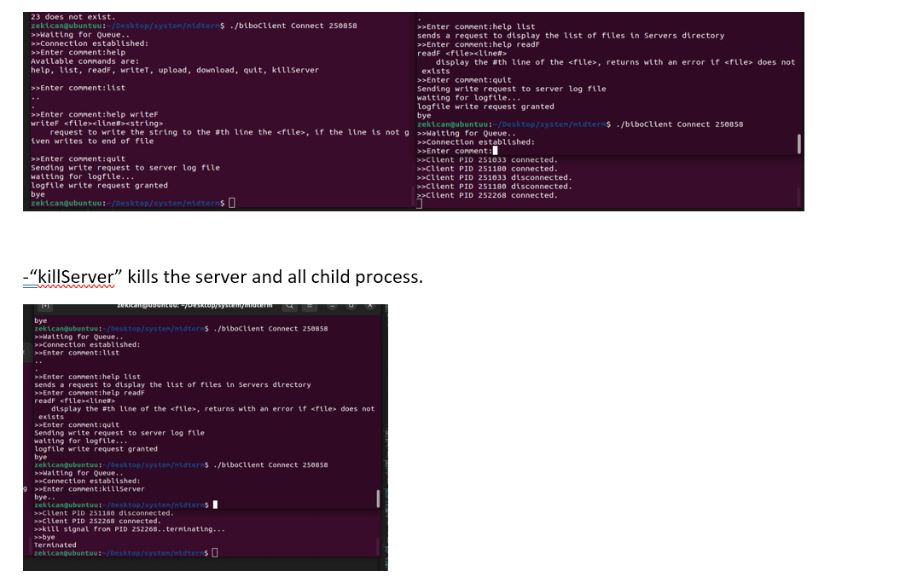

# MybiboBox : A Concurrent File Access System
## Description:
This assignment is similar to your midterm project, with the only difference being that you willbe creating  threads  instead  of  processes  to  handle  client  requests.  This  means  you  will  need  toimplement a thread pool. On the server side, instead of creating a separate process for eachrequest, a thread from the thread pool will be assigned to handle each requestTo begin, give the size of the thread pool as an argument on the server side (try values such as 5, 10, or 20). Size on "server side"creates a thread pool that can be set (try with 5, 10, 20), This is how they will communicate withtheir previously written clients.
Your  task  is  to  design  and  implement  a  file  server  that  enables  multiple  clients  to  connect,access and modify the contents of files in a specific directory.

The project should be implemented as a server side and a client-side programs

### Serverside:
- biboServer<dirname><max.#ofClients><poolSize>
The Server side would enter the specified directory (createdirname if the dirname does not exits),create  a  log  file  for  the  clients  and  prompt  its  PID  for  the  clients  to  connect.  The  for  each  clientconnected will fork a copy of itself in order to serve the specified client (commands are given on theclient  side).If  a  kill  signal  is  generated  (either  by  Ctrl-C  or  from  a  client  side  request)  Server  isexpected to display the request, send kill signals to its child processes, ensure the log file is createdproperlyandexit.

An example of the Server screen output might be in the following form:

### Client side:
- biboClient<Connect/tryConnect>ServerPID
-the client program with Connect optionrequest a spot from the Server Que with ServerPID andconnects if a spot is available (ifnot the client should wait until a spot becomes available,tryConnect option leaves without waiting if the Que is full).

When connected the client can performthefollowing requests :

An example of the Client screen output might be in the following form:

## Tests and Results

