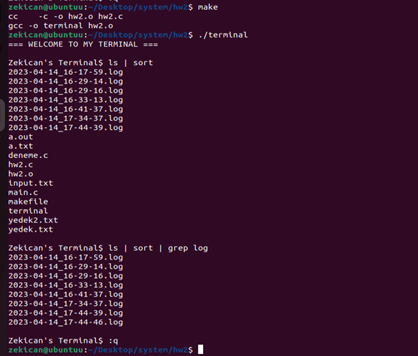
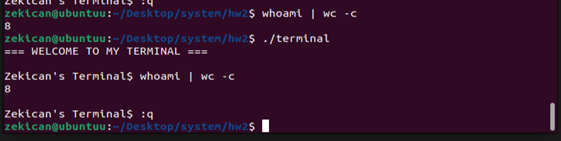
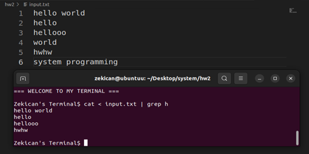
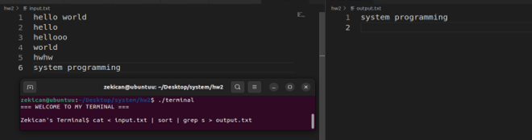
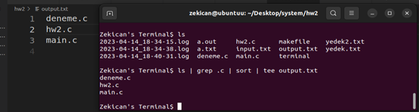
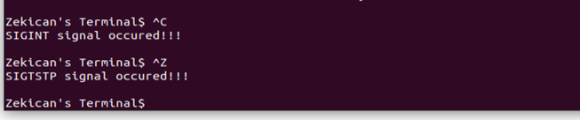
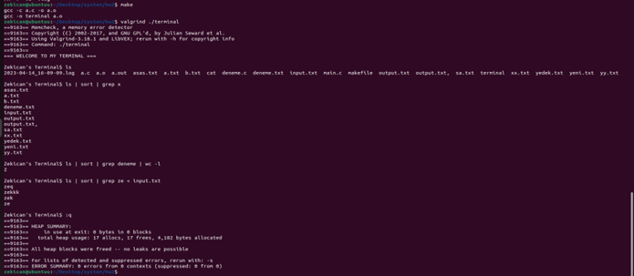

# - Developing Own Terminal -
## Requirements of the project:
-In this homework, you are expected to develop a terminal emulator capable of handling up to 20 shell commands in a single line, without using the"system()"function from the standard C library. Instead, you should utilize the “fork()”, “execl()”, “wait()”, and “exit()”functions. Your terminal emulator should include the following features: 

- Each shell command should be executed via a newly created child process, meaning that multiple commands will result in multiple child processes. 
- Proper handling of pipes ("|") and redirections ("<", ">") by redirecting the appropriate file descriptors. 
- Usage information should be printed if the program is not called properly. 
- Error messages and signals that occur during execution should be printed, and the program should return to the prompt to receive new commands. 
- Aside from a SIGKILL (which also should be handled properly) the program must wait for “:q” to finalize its execution.
- Upon completion, all pids of child processes with their corresponding commands should be logged in a separate file. Each execution should create a new log file with a name corresponding to the current timestamp. 
#
#
## Command Tests:

### “ls” and “ls | sort | grep” commands work correctly and also “:q” exits program.

### “whoami | wc -c” output:

### “cat < input.txt” | “grep h” output:

### “cat < input.txt” | “sort” | “grep s > output.txt” output:

### “ls | grep .c | sort | tee output.txt” output:

## Signal Tests:

## Memory Leak Test:

